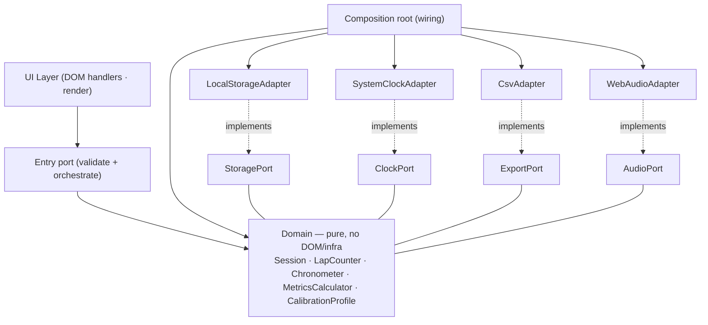

# Architecture Spine — WalkTracker PWA v1.0

## Design Paradigm

**Hexagonal-lite** (ports & adapters), right-sized to a single-file app. Three logical layers live inside one `index.html`; the **Domain** is pure JS (no DOM, no infra) so it is testable without a browser.

| Layer | Responsibility | May depend on |
| --- | --- | --- |
| **UI** | DOM handlers, render, pantalla Ajustes/Historial | Application entry port |
| **Application (entry port)** | Validate raw input, orchestrate use cases, wire adapters (composition root) | Domain + port interfaces |
| **Domain** | `Session` (aggregate root), `LapCounter`, `Chronometer`, `MetricsCalculator`, `CalibrationProfile` | nothing outward |
| **Adapters (edge)** | `LocalStorageAdapter`, `SystemClockAdapter`, `CsvAdapter`, `WebAudioAdapter` | Domain port interfaces (implement them) |

Ports are interfaces defined **in the domain**; adapters implement them. The composition root (in the Application layer) is the only place that knows concrete adapters.



The arrow set **is** the rule: every dependency points toward the Domain. The Domain defines the ports; nothing in the Domain imports an adapter, the DOM, or a browser API.

## Invariants & Rules

### AD-1 — Hexagonal-lite; dependency rule points inward
- **Binds:** all
- **Prevents:** domain coupling to framework/DOM/infra; UI calling storage directly.
- **Rule:** dependencies point toward the Domain. The Domain has zero imports of DOM or infrastructure. Ports are interfaces defined in the Domain; adapters live at the edge and implement them. *(Invariante de proyecto `AGENTS.md`.)*

### AD-2 — Vanilla JS single-file + separate sw.js  [ADOPTED]
- **Binds:** NFR-5
- **Prevents:** build toolchain, framework lock-in, CDN runtime dependency.
- **Rule:** one `index.html` (HTML+CSS+JS vanilla), no framework/bundler/CDN. `sw.js` is the only additional file (offline + PWA installable). *[fuente: SPEC ADR-01; NFR-5]*

### AD-3 — localStorage behind StoragePort  [ADOPTED]
- **Binds:** NFR-2, FR-7, FR-8
- **Prevents:** storage coupling leaking into the Domain.
- **Rule:** all persistence goes through `StoragePort` (`LocalStorageAdapter` implements). Keys: `wt:config`, `wt:sessions`, `wt:activeSession`. A future IndexedDB migration stays behind the port. *[fuente: SPEC ADR-02]*

### AD-4 — Session is the aggregate root; invariants enforced in the Domain  [ADOPTED]
- **Binds:** FR-1..FR-8
- **Prevents:** inconsistent session state; history rewrite on recalibration.
- **Rule:** `laps ≥ 0`, a finalized session is **immutable**, distance is always derived, and the perimeter is frozen at close. The Domain enforces these; the UI cannot bypass them. *[fuente: SPEC ADR-03]*

### AD-5 — Perimeter is derived, never stored as truth  [ADOPTED]
- **Binds:** FR-5, FR-6
- **Prevents:** dual sources of truth for the perimeter; history drift on recalibration.
- **Rule:** `lapPerimeterM = strideM × stepsPerLap`, computed. Config holds only the raw measurements (`strideM`, `stepsPerLap`); there is no editable `lapPerimeterM` field. Closed sessions keep their frozen perimeter. *[fuente: SPEC ADR-04]*

### AD-6 — Wall-clock chronometer; explicit-only pause  [ADOPTED]
- **Binds:** FR-1, NFR-3
- **Prevents:** drift from JS timers frozen by iOS backgrounding; incorrect time after recovery.
- **Rule:** `elapsedS = (now − startedAt) − totalPausesS`, computed from `Date.now()` via `ClockPort`. A `setInterval` may drive the display tick but is **never** the source of truth. Pause happens only via the explicit button; switching apps does not pause. *[fuente: SPEC ADR-05]*

### AD-7 — Validation at the frontier (entry port)
- **Binds:** FR-5, FR-6, all input
- **Prevents:** invalid aggregates materialized inside the Domain.
- **Rule:** raw inputs (`strideM`, `stepsPerLap`) are validated (`> 0`, finite numbers) at the entry port before any aggregate/calibration is constructed. The Domain remains always-valid. *(Invariante de proyecto `AGENTS.md`: validación en la frontera.)*

### AD-8 — Silent recovery from the active-session snapshot  [ADOPTED]
- **Binds:** NFR-3, FR-1
- **Prevents:** data loss on iOS purge; ambiguous resume UX.
- **Rule:** autosave the active session to `wt:activeSession` every lap and every 10 s. On open, if a snapshot exists, resume **silently** recomputing elapsed from `startedAt` (time with the app closed counts); no prompt. *[fuente: NFR-3]*

### AD-9 — Web Audio adapter for feedback; AudioContext unlocked at Start
- **Binds:** FR-9
- **Prevents:** a beep that fails on iOS (AudioContext suspended); reliance on the unavailable `navigator.vibrate`.
- **Rule:** feedback flows through `AudioPort` (`WebAudioAdapter`). The `AudioContext` is created lazily and resumed on the "Iniciar" user gesture. `navigator.vibrate` is not used (absent on iOS Safari). *[fuente: MDN AudioContext — `resume()`, contexto inicia suspendido; autoplay policy]*

### AD-10 — Offline-first via Service Worker app-shell cache  [ADOPTED]
- **Binds:** NFR-1
- **Prevents:** runtime network dependency.
- **Rule:** `sw.js` caches the app shell (`index.html`, `manifest.webmanifest`, icons) on `install` and serves it cache-first. Service Workers require a secure context (HTTPS) and register against an origin+path. *[fuente: MDN Service Worker API]*

### AD-11 — Deployment: GitHub Pages static; all paths relative  [ADOPTED]
- **Binds:** NFR-7
- **Prevents:** broken Service Worker scope / broken install under a project subpath.
- **Rule:** served as static files over HTTPS from GitHub Pages. `sw.js` registered with `scope: "./"`; `manifest.start_url` and `scope` are `"./"`; no absolute paths. `.nojekyll` present. Publish from `main` via PR (GitFlow). *[fuente: NFR-7; SPEC §13]*

## Consistency Conventions

| Concern | Convention |
| --- | --- |
| Naming (entities, files) | `PascalCase` domain types (`Session`, `CalibrationProfile`); `camelCase` functions/fields; localStorage keys prefixed `wt:` |
| Data & formats | timestamps ISO-8601 (ms) in storage; durations integer seconds; distance float meters (4 dp); perimeter displayed derived/readonly |
| State & mutation | Domain types immutable after construction; mutation returns new state; the only mutable store is `localStorage` via `StoragePort` |
| Errors | Domain throws specific errors (`RangeError` for invariant violation, `TypeError` for bad input); UI catches at the edge and shows feedback |
| Config | Single source `wt:config` (`strideM`, `stepsPerLap`); never duplicate perimeter |

## Stack

*Seed — verified current at authoring. The code owns this once it exists. Cero runtime dependencies.*

| Name | Version |
| --- | --- |
| JavaScript | ES2020+ (vanilla, sin transpile) |
| Platform | iOS Safari — PWA instalable ("Agregar a pantalla de inicio") |
| Service Worker API | nativa (requiere HTTPS) *[fuente: MDN]* |
| Web Audio API | nativa (Baseline, disponible desde abr-2021) *[fuente: MDN AudioContext]* |
| Web Storage (localStorage) | nativa |

## Structural Seed

```text
{root}/                       # raíz servida por GitHub Pages
  index.html                  # UI + Application (entry port, composition root) + Domain (puro, extraíble para test)
  sw.js                       # Service Worker: cache app-shell (cache-first), offline
  manifest.webmanifest        # start_url "./", scope "./", display standalone, iconos relativos
  .nojekyll                   # evita procesado Jekyll en Pages
  icons/                      # iconos PWA (relativos)
  test/                       # pruebas del dominio puro (ver OQ-A1): node nativo o runner dev-only
```

**Port contracts (seed — el código los detalla):**

```text
StoragePort:  getConfig(), saveConfig(cfg), getSessions(), saveSession(s),
              getActiveSession(), saveActiveSession(s|null)
ClockPort:    now() → epochMs
ExportPort:   toCsv(sessions) → string, toJson(sessions) → string   # schema CSV → v1.1 (OQ-2)
AudioPort:    unlock()   # reanuda AudioContext en gesto de usuario
              beep()
```

**Storage shapes (pinned — cierra divergencias de AD-5/AD-8):**

```text
wt:config         → { strideM: number, stepsPerLap: number }        # medidas crudas; perímetro derivado, NUNCA aquí
wt:activeSession  → { startedAtMs, laps, totalPausesMs, paused, strideM, stepsPerLap }
                    # raw inputs al inicio → perímetro reconstruible; startedAtMs habilita la recuperación wall-clock (AD-8)
wt:sessions       → [ { id, startedAt, endedAt, laps, lapPerimeterM (congelado),
                        distanceM, durationS, paceSecPerKm, pausesS } ]   # finalized, append-only (SPEC §7)
```

**Entornos / sobre operativo:** un solo entorno de runtime (producción = GitHub Pages). Desarrollo local sirviendo `index.html` sobre HTTPS (`http://localhost` cuenta como secure context para SW). No hay backend, CI/CD de servidor ni infraestructura cloud — el despliegue es `git push`/Action a Pages desde `main`.

## Capability → Architecture Map

| Capability / Area | Lives in | Governed by |
| --- | --- | --- |
| FR-1 Control sesión + cronómetro | `Session` + `Chronometer` + `ClockPort` | AD-1, AD-6, AD-8 |
| FR-2 Botón +1 gigante | UI Layer | NFR-4 |
| FR-3 Deshacer vuelta | `Session` (lap/undo) | AD-4 |
| FR-4 Métricas en vivo | `MetricsCalculator` | AD-4, AD-5 |
| FR-5 Perímetro derivado | `CalibrationProfile` | AD-5, AD-7 |
| FR-6 Recalibración in-app | `CalibrationProfile` + `StoragePort` | AD-5, AD-7 |
| FR-7 Persistencia | `StoragePort` / `LocalStorageAdapter` | AD-3 |
| FR-8 Historial + totales | `StoragePort` + UI | AD-3 |
| FR-9 Beep feedback | `AudioPort` / `WebAudioAdapter` | AD-9 |
| NFR-1 Offline | `sw.js` | AD-10 |
| NFR-3 Resiliencia/recuperación | `StoragePort` + `Chronometer` | AD-8 |
| NFR-7 Despliegue | infra GitHub Pages | AD-11 |

## Deferred

- **TDD del dominio vanilla (OQ-A1):** cómo correr pruebas del core puro sin bundler (Node nativo vs. runner dev-only). No bloquea v1.0; resolver al iniciar la épica de tests.
- **`wakeLock` (RF-12, v1.1):** `navigator.wakeLock` requiere iOS Safari 16.4+ — confirmar la versión del dispositivo de Paul al promocionar (OQ-A2).
- **Migración a IndexedDB:** queda detrás de `StoragePort`; solo si el volumen escala (irrelevante a < 100 KB/año).
- **Schema CSV vs *Health Importer* (RF-10, v1.1):** diferido con el PRD (OQ-2).
- **Calibración interactiva** (caminar N vueltas contando pasos): decisión de producto futura (PRD OQ-3).
- **Cache-busting / versionado de `sw.js`:** estrategia de actualización del SW al publicar nuevas versiones (p. ej. versión en `CACHE_NAME` + `skipWaiting`).
