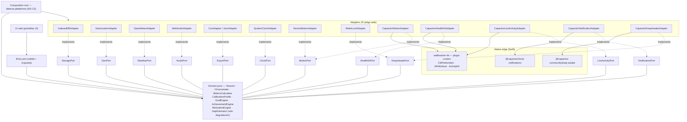

# Architecture Spine — WalkTracker iOS (Capacitor)

## Design Paradigm

**Hexagonal-lite** (ports & adapters) — el mismo paradigma de la v1/v3, ahora con una segunda orilla nativa. La web app v3 (UI + Application + Domain) se sirve intacta dentro del WKWebView de Capacitor; las capacidades del sistema se consumen vía plugins que implementan puertos del dominio. El dominio sigue sin importar DOM, infra, **ni Capacitor**.

| Layer | Responsibility | May depend on |
| --- | --- | --- |
| **UI** (web) | Pantallas v3 (Home/Sesión/Summary/Historial/Logros/Ajustes/Motivación/MotionDenied) | Application entry port |
| **Application** (web) | Composition root: detecta plataforma, valida input en frontera, orquesta casos de uso, registra adapters | Domain + port interfaces |
| **Domain** (web, puro) | `Session`, `Chronometer`, `MetricsCalculator`, `CalibrationProfile`, `GoalEngine`, `AchievementEngine`, `MotivationEngine`, `GapEstimator` (solo degradación) | nothing outward |
| **Adapters JS** (edge web) | `IndexedDBAdapter`, `GeolocationAdapter`, `OpenMeteoAdapter`, `WebAudioAdapter`, `CsvAdapter`, `JsonAdapter`, `SystemClockAdapter`, `DeviceMotionAdapter`, `WakeLockAdapter` + **nuevos**: `CapacitorMotionAdapter`, `CapacitorHealthKitAdapter`, `CapacitorLiveActivityAdapter`, `CapacitorNotificationAdapter`, `CapacitorKeepAwakeAdapter` | Domain port interfaces |
| **Native edge** (Swift) | `walktracker-kit` (plugin custom: CMPedometer, HKWorkout, ActivityKit) + plugins comunitarios (keep-awake, local-notifications) | iOS SDK; expone métodos al bridge Capacitor |



El set de flechas **es** la regla: toda dependencia apunta hacia el Domain. El Domain define los puertos; nada en el Domain importa un adapter, el DOM, una API del navegador **ni Capacitor**.

## Inherited Invariants

Del spine v3 (`ARCHITECTURE-SPINE-v3.md`) — viven en la web app que se empaqueta sin cambios. IDs originales, read-only.

| Inherited | From parent | Binds here |
| --- | --- | --- |
| AD-1 (hexagonal-lite, dependencias hacia adentro) | spine v3 | toda la capa web; el plugin nativo es un adapter más |
| AD-4 (Session aggregate: stepsMeasured/stepsEstimated/strideM; finalizada inmutable) | spine v3 | modelo de sesión en ambos canales |
| AD-5 (strideM única medida cruda; congelada al cierre) | spine v3 | calibración, distancia fallback |
| AD-6 (cronómetro wall-clock; pausa explícita) | spine v3 | CAP-1 en ambos canales |
| AD-7 (validación en la frontera) | spine v3 | todo input de Ajustes e import |
| AD-8 (autosave + recuperación silenciosa) | spine v3 | resiliencia de sesión activa |
| AD-14 (Open-Meteo; timeout 3s; degradación limpia) | spine v3 | clima en ambos canales (fetch desde WebView) |
| AD-17 (geolocation one-shot; coordenadas a 2 decimales) | spine v3 | privacidad del clima |
| AD-18 (quotes.json en bundle; sin repetición últimas 20) | spine v3 | motivación en ambos canales |

## Invariants & Rules

### AD-C1 — Capacitor como capa nativa; la web app se empaqueta intacta [ADOPTED — OQ-1 spec]
- **Binds:** all
- **Prevents:** rewrite de la app; doble mantenimiento web/nativo; acoplamiento del dominio a Capacitor.
- **Rule:** la web app v3 (index.html, domain.js, motivation.js, climate.js, storage.js, runtime.js, quotes.json, assets) se sirve desde el bundle local del WebView. El código web referencia APIs de Capacitor **solo dentro de los adapters `Capacitor*` y del composition root** — nunca en Domain ni UI, nunca en import-time de módulos compartidos con la PWA. **Excepción deliberada:** `domain.js` admite dos correcciones de portación (ver AD-C2 y convención UX) que rompen la regla "sin cambios" por mandato del spec: evaluación de logros temporales en **hora local del dispositivo** (no UTC) y mapeo de condición climática por **código WMO → categoría interna `rain`** (no regex sobre strings localizados).

### AD-C2 — Una sola frontera nativa custom: `walktracker-kit` [ADOPTED — Decisión 1]
- **Binds:** CAP-2, CAP-3, CAP-11, CAP-18
- **Prevents:** tres fronteras nativas divergentes; dependencias de terceros sin auditar (licencia/mantenimiento); serializar estado de sesión por el bridge para alimentar la Live Activity.
- **Rule:** un único plugin custom `walktracker-kit` (paquete local `./walktracker-kit`, podspec propio, referencia `file:` en package.json) envuelve: CMPedometer (updates en vivo + `queryPedometerData` por rango), escritura `HKWorkout`, y el bridge ActivityKit. Los adapters JS `CapacitorMotionAdapter`, `CapacitorHealthKitAdapter` y `CapacitorLiveActivityAdapter` hablan solo con él. Keep-awake y local-notifications usan los plugins comunitarios verificados (MIT) — no se reimplementan.

### AD-C3 — Doble canal con detección de plataforma en el composition root [ADOPTED — Decisión 2]
- **Binds:** all; deployment
- **Prevents:** romper el despliegue PWA vivo; fallos en web por APIs Capacitor ausentes; features nativas prometidas en el canal que no las soporta.
- **Rule:** el composition root detecta plataforma (`Capacitor.isNativePlatform()` + disponibilidad del plugin) y registra adapters nativos cuando existen, web en caso contrario. La PWA (GitHub Pages) es canal **secundario**: no recibe features que dependan de nativo (HealthKit, Live Activity, recordatorios) y sigue degradando limpio como hoy. Toda feature nueva nace con su camino de degradación web definido. La cláusula "toda feature nueva nace con su camino de degradación web definido" es aspiracional (proceso) → movida a Deferred.

### AD-C4 — Reconstrucción por query del sistema como camino primario de pasos en background
- **Binds:** CAP-2, CAP-3
- **Prevents:** portar por inercia la estrategia PWA (estimar por cadencia) cuando el dato exacto existe.
- **Rule:** en nativo, los pasos de cualquier intervalo sin entrega en vivo (background, app purgada) se obtienen con `queryPedometerData(from: startedAt, to: now)`. `GapEstimator` opera **solo** si la query falla o devuelve vacío — y entonces con todas las reglas heredadas (muestra ≥120 s, desglosado, "~", descartable). En web (canal secundario) el GapEstimator sigue siendo el camino principal.

### AD-C5 — Distribución: builds locales para iterar; TestFlight como canal duradero [ADOPTED — Decisión 3]
- **Binds:** deployment, operations
- **Prevents:** firma expirada sin Mac a mano; fricción de cable por cada actualización; ambigüedad sobre qué build está en el teléfono.
- **Rule:** el loop de desarrollo usa builds locales de Xcode (`pnpm cap run ios`). La instalación duradera en el iPhone de Paul es **TestFlight** (cuenta Apple Developer activa): todo hito que pase la **prueba de performance del Success signal del spec** (caminata dogfood de 60 min con música y pantalla bloqueada, ≤10 % vs Salud, sin degradación de batería notoria) se sube como build de TestFlight. App Store fuera de scope. La PWA se despliega como hoy (merge a `main` → GitHub Pages, GitFlow).

### AD-C6 — La Live Activity se alimenta de eventos nativos, no del WebView
- **Binds:** CAP-18
- **Prevents:** Live Activity congelada con el teléfono bloqueado — el caso de uso central — porque el JS del WebView se suspende en background.
- **Rule:** `walktracker-kit` actualiza la Activity directamente desde sus callbacks de CMPedometer (mismo proceso, sin round-trip JS). El WebView solo ordena crear/actualizar estado mayor (inicio, pausa, fin) vía `LiveActivityPort`. La UI web sigue mostrando métricas por su propio canal; la Live Activity nunca depende de que el WebView esté vivo.

### AD-C7 — Bundle local únicamente; sin carga remota ni OTA
- **Binds:** CAP-9, offline, deployment
- **Prevents:** dependencia de red en runtime (rompería no-backend y offline); deriva silenciosa entre lo probado y lo servido.
- **Rule:** la app carga solo archivos del bundle (`webDir` local; prohibido `server.url` apuntando a red en producción). Las actualizaciones llegan por nuevo build/TestFlight. La única llamada de red de la app sigue siendo Open-Meteo (AD-14 heredado).

### AD-C8 — HealthKit y notificaciones: escritura al cierre, permisos con pre-pantalla
- **Binds:** CAP-11, CAP-17
- **Prevents:** workouts parciales o duplicados en Salud; prompts de permiso en frío; recordatorios duplicados o huérfanos.
- **Rule:** `HealthKitPort.writeWorkout()` se invoca **una vez, al finalizar la sesión** (dato inmutable completo: distancia, pasos, duración). Toda petición de permiso del sistema (movimiento, Salud, notificaciones, ubicación) va precedida de su pantalla explicativa. Los recordatorios de meta se (re)programan de forma **idempotente** desde `GoalEngine` al finalizar sesión y al abrir la app — primero se cancelan los existentes, luego se agenda el nuevo.

## Consistency Conventions

| Concern | Convention |
| --- | --- |
| Naming | Puertos nuevos `XxxPort`; adapters Capacitor `Capacitor<Xxx>Adapter`; plugin nativo `walktracker-kit` (métodos camelCase, prefijo de clase `WTK`); sin tipos de Capacitor/Swift en Domain ni UI |
| Data & formats | Heredados de v3: timestamps ISO-8601 (ms); duraciones enteras en s; distancia float m (2 dp); pasos enteros; cadencia float spm (1 dp); shapes de storage sin cambios (spec `domain-model.md` §8) |
| State & mutation | Domain inmutable; mutación retorna nuevo estado. Los únicos mutables: storage (vía StoragePort) y el estado de sesión nativo dentro de `walktracker-kit` (privado, no expuesto) |
| Errors | Domain lanza errores específicos (`RangeError`/`TypeError`); adapters JS capturan fallos de plugin/permiso/red y degradan limpio (null o flag); el plugin Swift responde con `call.reject` con código de error estable, nunca excepción cruzando el bridge |
| Package management | `pnpm` (invariante AGENTS.md) para CLI y deps JS; pods via `npx cap sync` |
| Version sync de canales | App y PWA se construyen del mismo commit (GitFlow: feature → develop → main). El build de TestFlight y el deploy de Pages de un mismo hito salen del mismo merge a `main` |
| Privacy | Sin analítica ni telemetría; única red: Open-Meteo (coordenadas a 2 dp); HealthKit solo escritura de workouts propios |
| Entitlements/Info.plist | `NSMotionUsageDescription`, `NSLocationWhenInUseUsageDescription`, `NSHealthShareUsageDescription`, capability HealthKit; Live Activity no requiere entitlement extra (iOS 16.1+) |
| **UX (invariant)** | **Targets ≥ 44 pt; claro/oscuro por `prefers-color-scheme`; dirección "celebrar, nunca culpar"; números grandes; UI en español; overlay motivacional 3–4 s saltable con tap** |

## Stack

*Seed — verificado en npm/docs el 2026-07-28. El código es dueño una vez exista.*

| Name | Version | Source |
| --- | --- | --- |
| JavaScript (web app) | ES2020+ vanilla, sin build | heredado v3 |
| @capacitor/core | 8.4.2 (MIT) | npm registry |
| @capacitor/cli | 8.4.2 (MIT; Node ≥ 22) | npm registry |
| @capacitor/ios | 8.4.2 (MIT) | npm registry |
| @capacitor/local-notifications | 8.2.1 (MIT) | npm registry |
| @capacitor-community/keep-awake | 8.0.1 (MIT) | npm registry |
| @capacitor/preferences | 8.0.1 (MIT) | npm registry |
| iOS deployment target | 16.1 (piso ActivityKit; dispositivo Paul iOS 17+) | spec A-2 + Apple docs |
| Xcode | 26.0+ (requerido por Capacitor 8) | capacitorjs.com/docs/ios |
| Swift (walktracker-kit) | toolchain de Xcode 26 | — |
| CMPedometer / HealthKit / ActivityKit | SDK del sistema | Apple |
| CocoaPods | el que exija Capacitor 8 | capacitorjs.com |

## Structural Seed

```text
walktracker/                  # repo único (GitFlow)
  index.html                  # UI + Application (composition root; detección plataforma)
  domain.js                   # Domain puro (con 2 correcciones de portación: hora local en logros, WMO→rain)
  motivation.js climate.js storage.js runtime.js migration.js
  quotes.json manifest.webmanifest sw.js icons/   # PWA (canal secundario, sigue viva)
  package.json                # + @capacitor/*, plugins; gestión con pnpm
  capacitor.config.json       # appId, webDir local; SIN server.url (AD-C7)
  walktracker-kit/            # plugin custom local (AD-C2) — se versiona en el repo
    package.json  WalktrackerKit.podspec
    ios/Sources/WalktrackerKitPlugin/   # Swift: CMPedometer, HKWorkout, ActivityKit
  ios/                        # proyecto Xcode (cap add ios; se commitea)
    App/App.xcworkspace  App/App/Info.plist  entitlements
  test/                       # tests del dominio (Node nativo; sin cambios)
  e2e/                        # Playwright (web/PWA)
```

**Port contracts nuevos (seed — el código los detalla):**

```text
MotionPort (nativo):   requestPermission() → bool
                       start(sessionStartedAtMs) → stream onSteps(cumulativeCount, distanceM?)
                       stop()
                       query(fromMs, toMs) → { steps, distanceM } | null        # AD-C4; null = degradar a GapEstimator
MotionPort (web):      requestPermission() → bool
                       onSample(callback)                                      # magnitud aceleración @ 60 Hz
                       start()  stop()
HealthKitPort:         requestPermission() → bool
                       writeWorkout(session) → bool              # una vez, al finalizar (AD-C8)
LiveActivityPort:      start(sessionSummary) → activityId | null
                       updateState(paused | finished)            # solo estado mayor (AD-C6)
                       stop()
NotificationPort:      requestPermission() → bool
                       rescheduleWeeklyReminder(goalProgress)    # idempotente (AD-C8)
KeepAwakePort:         acquire()  release()                     # sesión activa en foreground
```

**Entornos / sobre operativo:** dev = builds locales de Xcode (iPhone físico — el simulator no tiene acelerómetro real) + `http://localhost` para la web; prod = TestFlight (app, canal principal) + GitHub Pages (PWA, canal secundario). Sin backend, sin CI de servidor; distribución = archive → App Store Connect → TestFlight (AD-C5).

## Capability → Architecture Map

| Capability / Area | Lives in | Governed by |
| --- | --- | --- |
| CAP-1 Sesión + cronómetro | `Session` + `Chronometer` (web, sin cambios) | AD-6 heredado (v3), AD-8 heredado |
| CAP-2 Pasos 24/7 | `walktracker-kit` (CMPedometer) + `CapacitorMotionAdapter` | AD-C1, AD-C2 |
| CAP-3 Reconstrucción background | `MotionPort.query` + `GapEstimator` (degradación) | AD-C4 |
| CAP-4 Métricas en vivo | `MetricsCalculator` (web) | AD-C4/5 heredados (v3) |
| CAP-5 Clima snapshot | `OpenMeteoAdapter` + `GeolocationAdapter` (fetch desde WebView) | AD-14/17 heredados |
| CAP-6 Frase motivacional | `MotivationEngine` + `quotes.json` | AD-18 heredado |
| CAP-7 Meta semanal | `GoalEngine` + UI | spec domain-model §5 |
| CAP-8 Logros (14) | `AchievementEngine` + StoragePort | spec achievements.md |
| CAP-9 Persistencia garantizada | IndexedDB/localStorage en sandbox de app (`@capacitor/preferences` si hiciera falta, tras StoragePort) | AD-C7, AD-3 heredado (v3) |
| CAP-10 Historial | StoragePort + UI (canvas/SVG) | heredado v3 |
| CAP-11 HealthKit | `walktracker-kit` (HKWorkout) + `CapacitorHealthKitAdapter` | AD-C2, AD-C8 |
| CAP-12 Háptica + sonido | `WebAudioAdapter` (sonido) + háptica vía `walktracker-kit` o API web si suficiente | AD-C2; Deferred: decisión de canal háptico |
| CAP-13 Recalibración | `CalibrationProfile` + UI Ajustes | AD-5/7 heredados (v3) |
| CAP-14 Export/import | `CsvAdapter`/`JsonAdapter` + share sheet | AD-15 heredado (v3) |
| CAP-15 Eliminar sesiones | `StoragePort.deleteSession()` | AD-3 heredado (v3) |
| CAP-17 Recordatorios | `@capacitor/local-notifications` + `CapacitorNotificationAdapter` | AD-C8 |
| CAP-18 Live Activity | `walktracker-kit` (ActivityKit) + `CapacitorLiveActivityAdapter` | AD-C2, AD-C6 |
| Doble canal / detección | composition root (`index.html`) | AD-C3 |
| Distribución | TestFlight + GitHub Pages | AD-C5, AD-C7 |

## Deferred

- **Protocolo de validación de performance** (Success signal del spec): caminata dogfood de 60 min con música y pantalla bloqueada en el iPhone de Paul; Instruments solo si aparecen síntomas. Nivel de epic/story, no de spine.
- **Canal háptico concreto** (CAP-12): CoreHaptics dentro de `walktracker-kit` vs API disponible vía WebView; se decide en la story con prueba en dispositivo. No bloquea: el sonido ya existe. **Regla de aterrizaje:** se resuelve como adapter tras un puerto, nunca llamada directa al plugin.
- **Contenido/formato de la Live Activity** (layouts, qué métricas, stale dates): decisión de UX/implementación de la story; el spine solo fija que la alimenta el nativo (AD-C6).
- **Sincronización PWA↔app de datos** (mismo usuario, dos instalaciones): no existe hoy (arranque limpio, OQ-3 del spec); si Paul algún día quiere continuidad, se reactiva CAP-16.
- **Calibración interactiva de zancada** (caminar N pasos para medirla): producto futuro, heredado del deferred de v3.
- **Cache-busting del SW de la PWA**: problema heredado de v1/v3, sin cambios en este spine.
- **Regla de degradación web por feature nueva** (cláusula aspiracional de AD-C3): proceso, no verificable en código; se gestiona en planning de epics.