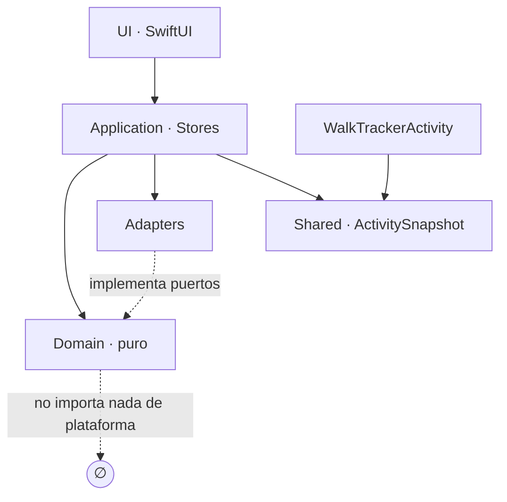
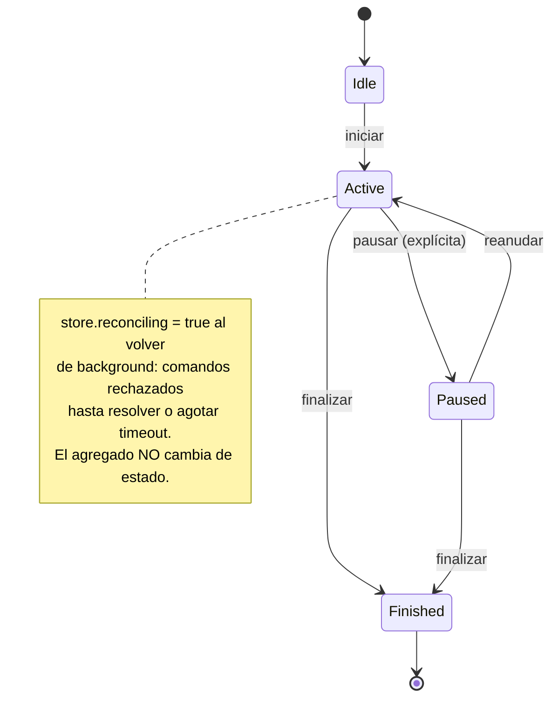

# Architecture Spine — WalkTracker iOS (SwiftUI nativa)

> **El contrato de producto es `SPEC.md` y sus companions, por referencia, no por copia.** Este spine no reproduce restricciones del SPEC: las gobierna. Toda restricción del SPEC que exige un mecanismo arquitectónico tiene aquí un AD que la hace verificable; el resto sigue viva en el SPEC y vincula igual. `DEROGACIONES.md` lista lo que este spine anula y lo que absorbe.

## Design Paradigm

**Hexagonal (ports & adapters)** con **un único escritor en el main actor**.

| Capa | Directorio | Puede importar |
| --- | --- | --- |
| Domain | `Domain/` | Solo `Foundation` |
| Application | `Application/` | `Domain` |
| Adapters | `Adapters/` | `Domain` (implementa sus puertos) |
| UI | `UI/` | `Application`, `Domain` (solo lectura) |
| Shared | `Shared/` | Solo `Foundation` |
| Extensión | `WalkTrackerActivity/` | `Shared` únicamente |



## Invariants & Rules

### AD-1 — Sustrato: SwiftUI nativo [ADOPTED]

- **Binds:** todo
- **Prevents:** que el sustrato se decida por mockup en vez de por decisión explícita
- **Rule:** app SwiftUI contra el SDK de iOS 26. Sin WebView, sin Capacitor, sin Flutter en el producto. Deroga `PLAN-CAPACITOR-v2.md` y reabre OQ-1; el inventario completo de lo derogado y lo absorbido está en `DEROGACIONES.md`, que es vinculante. **Absorbe AD-IOS-01:** el bundle id es `com.walktracker.app`, inmutable.

### AD-2 — Suelo de despliegue iOS 26.0 [ADOPTED]

- **Binds:** todo
- **Prevents:** pagar compatibilidad hacia atrás para un universo de instalación de un dispositivo
- **Rule:** deployment target 26.0. **Prohibido `if #available` hacia versiones anteriores.** Dispositivo de validación: iPhone 14 (A15, sin Dynamic Island). Deroga A-2 del SPEC (iOS 17+) y el 16.1 del ciclo Capacitor.

### AD-3 — Dirección de dependencias

- **Binds:** todas las capas
- **Prevents:** lógica de negocio atrapada en una vista o en un adapter, y por tanto no verificable
- **Rule:** las dependencias apuntan **hacia dentro**. `Domain/` no importa `SwiftUI`, `CoreMotion`, `HealthKit`, `ActivityKit`, `CoreLocation` ni `UIKit`. Un `import` de plataforma en `Domain/` es un fallo de build. El dominio **nunca** llama a `Date()`, `Date.now` ni `random()` — llegan por puerto (corrige `domain.js:249` y `:392`).

### AD-4 — El dominio es Swift idiomático, no `domain.js` transliterado

- **Binds:** `Domain/`
- **Prevents:** Swift ilegible que nadie mantiene, y la falsa seguridad de creer que *parecerse* a `domain.js` equivale a *comportarse* como él
- **Rule:** value types, métodos, `throws`, errores tipados, opcionales para métricas ausentes (un ritmo por debajo de 100 m es `nil`, no `0` ni `-1`). Se conservan los nombres del lenguaje ubicuo de `domain-model.md §1`. La equivalencia con la v3 se demuestra por AD-6, nunca por parecido del código.

### AD-5 — Catálogo en datos, con esquema publicado y evaluación exhaustiva

- **Binds:** CAP-8, `AchievementEngine`
- **Prevents:** el incidente del 2026-09-11 (catálogo reteclado a mano en Dart: 7 logros, semántica alterada) **y** la divergencia de esquema que el propio "en datos" permite si no se publica
- **Rule:** `Resources/achievements.json` lleva **metadatos y umbrales**; la evaluación es **Swift**. No hay mini-DSL ni intérprete. Esquema, vinculante:

```jsonc
{ "schemaVersion": 1,
  "achievements": [
    { "key": "first_km",        // clave estable de achievements.md, nunca renumerada
      "name": "Tu primer kilómetro",
      "description": "Completa 1 km en una sesión",
      "icon": "🏅",
      "metric": "sessionDistanceM", // enum cerrado, ver más abajo
      "threshold": 1000,
      "comparison": "gte" }       // gte | lte | eq
  ] }
```

`metric` es un enum cerrado en Swift: `sessionDistanceM · totalDistanceM · sessionCount · consecutiveDays · startHourLocal · weatherCategory · tempC · paceSecPerKm · weeklyGoalMet`. El evaluador es un `switch` **exhaustivo** sobre ese enum — una métrica nueva sin rama no compila. El arranque valida: 14 entradas, claves únicas, todas las de `achievements.md`, `metric` conocida. **Falla ruidosamente**, no degrada.

### AD-6 — Prueba de equivalencia con la v3: tres categorías y divergencias declaradas

- **Binds:** `Domain/`, CAP-1, CAP-3, CAP-4, CAP-7, CAP-8, CAP-13
- **Prevents:** que "idiomático" sea coartada para cambiar comportamiento en silencio — **y** que la prueba de equivalencia congele bugs conocidos como contrato
- **Rule:** la suite JS actual (**281 aserciones ejecutadas**, no 168 — el número anterior estaba reteclado sin verificar) se reparte en tres categorías, y cada aserción pertenece exactamente a una:

| Categoría | Qué | Cómo |
| --- | --- | --- |
| **Vectores** (~65) | Cálculos puros entrada → salida: `elapsedS`, `pace`, `v3distance`, cadencia, `recalibrate`, estimación de gap | Ficheros de datos neutrales. Los ejecutan `domain.js` **y** el dominio Swift |
| **Escenarios** (~111) | Secuencias de comandos sobre agregado mutable | Portados **a mano** a Swift Testing, con el test JS como referencia citada. No son vectores: el formato no los admite |
| **Excluidos** (~52) | La agregada v1 de vueltas | `domain-model.md §2` la elimina. No hay runtime Swift contra el que correrlos. **Declarados muertos, no olvidados** |

**Vectores nuevos, de autoría propia y obligatorios.** Ninguno de los cuatro ficheros JS contiene una sola aserción de `GoalEngine` ni de `AchievementEngine`, y **8 de los 14 logros no tienen ninguna cobertura** — entre ellos `first_5km`, precisamente el que cambió de semántica en Dart. La extracción sola no habría detectado el incidente que AD-5 previene. Se **escriben** vectores para los 14 logros (caso que desbloquea y caso que no) y para el `GoalEngine` (semana ISO, límites de lunes y domingo).

**Divergencias declaradas.** Estas son las conductas donde el dominio Swift **debe** diferir de `domain.js`. Su vector lleva el valor **corregido**, y `domain.js` está registrado como fallando ese vector a propósito:

| Divergencia | Fuente | Hoy en la v3 |
| --- | --- | --- |
| `early_bird`, `night_walker` y rachas en **hora local**, no UTC | `domain-model.md §9`, `achievements.md` | UTC |
| Lluvia por **código WMO** → categoría interna, no regex sobre string localizado | `achievements.md` | `/lluv\|llovi\|torment/i` |
| ~~Las pausas se restan una vez~~ | `domain-model.md §4` | **Ya no diverge:** corregido en la v3 el 2026-09-12. `domain.js` pasa el vector |
| ~~Rachas comparando fechas como fechas~~ | verificado | **Ya no diverge:** corregido en la v3 el 2026-09-12. `domain.js` pasa el vector |

Las dos primeras siguen siendo divergencias reales: son decisiones de plataforma. Las dos tachadas
eran **defectos**, y se arreglaron en la referencia antes de portar (decisión de Paul) — lo que además
permite **validar el arnés de vectores contra un runtime que ya existe**, antes de apostarle el port.

**Cumplimiento sin CI.** No hay servidor de integración (`SPEC` no-backend, AR-11). La ejecución de vectores y escenarios es un **script local** (`Scripts/verify-domain.sh`) que corre ambos runtimes, y su paso en verde es **Definition of Done de cada historia que toca `Domain/`**. Decir "bloquea el merge" sin mecanismo sería una aspiración, no una regla.

### AD-7 — Escritor único, y la frontera cruza con un DTO propio

- **Binds:** CAP-1, CAP-2, CAP-3, CAP-4, CAP-18
- **Prevents:** cuatro caminos de escritura concurrentes sobre un agregado que debe ser inmutable al cerrarse
- **Rule:** `SessionStore` es `@Observable` y `@MainActor` y es **el único** que muta la sesión. Adapters y temporizadores no escriben: publican eventos. **`CMPedometerData` no conforma a `Sendable`, y sus `NSNumber` tampoco** — el handler de CoreMotion, que corre en su propia cola serie, extrae los valores a un `struct` `Sendable` propio *dentro del handler* y solo ese DTO cruza al main actor. Pasar el objeto de CoreMotion es un error de compilación bajo AD-12, no un detalle de estilo. Descartado un `actor` fuera del main con proyección: cambia un riesgo de concurrencia inexistente a este volumen por un riesgo de coherencia real.

### AD-8 — La reconciliación es atómica, acotada, y vive fuera del dominio

- **Binds:** CAP-3, CAP-1
- **Prevents:** cerrar una sesión con pasos que llegan tarde; que `finish()` compita con una query en vuelo; y confiar en una query que falla en silencio
- **Rule:** al volver a foreground, la reconstrucción del gap es **atómica**: mientras dura, `SessionStore` rechaza todo comando y la UI los deshabilita. `reconciling` es estado del **store**; `SessionStatus` sigue siendo `idle / active / paused / finished`. **`queryPedometerData` solo cubre 7 días y, pasado ese rango, devuelve datos parciales sin señalar error** — un gap con inicio anterior a 7 días **no se consulta**: se degrada directamente a estimación marcada `~`. La operación está acotada por timeout; al agotarse degrada igual y libera los comandos. Atómico sin timeout es un bloqueo con buenos modales.



### AD-9 — Persistencia en JSON; el export es un contrato aparte

- **Binds:** CAP-9, CAP-10, CAP-14, CAP-15, CAP-1
- **Prevents:** acoplar el dominio a un framework de persistencia; y declarar resuelto el CSV que CAP-14 exige
- **Rule:** ficheros JSON `Codable` en Application Support, **escritura atómica** (temp + rename), cada uno con `schemaVersion`:

| Fichero | Contiene | Escrito por |
| --- | --- | --- |
| `sessions.json` | Historial de sesiones finalizadas | `HistoryStore` |
| `achievements.json` | Estado `{key, unlockedAt, progress}` | `AchievementsStore` |
| `settings.json` | Zancada, meta, toggles | `SettingsStore` |
| `activeSession.json` | Snapshot de la sesión viva, autosave cada 10 s | `SessionStore` |

`activeSession.json` es lo que hace posible la recuperación tras force-quit que CAP-1 y CAP-9 exigen (`domain-model.md §8`). **`§8` lo define en milisegundos; el dominio trabaja en segundos** — la conversión ocurre en el adapter de persistencia, nunca dentro.

**Export (CAP-14) es un contrato propio, no "el mismo formato".** El JSON de export **sí** reutiliza la serialización de `sessions.json`. El **CSV no**: es un segundo serializador y se especifica aquí porque dos historias lo escribirían distinto — columnas en este orden `fecha;hora;duracion_s;pasos_medidos;pasos_estimados;distancia_m;ritmo_s_km;fuente`, **separador de campo `;` y decimal `,`** (UI en español, y `,` como decimal rompe el CSV con separador `,`), cabecera siempre presente, UTF-8 con BOM para que Numbers y Excel lo abran sin pelear. El **import solo acepta JSON**, nunca CSV.

### AD-10 — Un puerto por capacidad de sistema, definido por el núcleo

- **Binds:** CAP-2, CAP-5, CAP-6, CAP-11, CAP-12, CAP-17, CAP-18
- **Prevents:** que dos pantallas hablen con un framework de sistema por su cuenta y cada una interprete el resultado a su manera
- **Rule:** un protocolo por capacidad en `Domain/Ports/`, implementado en `Adapters/`. **Ninguna vista importa un framework de sistema.** El conjunto es cerrado:

`MotionPort` · `LocationPort` · `WeatherPort` · `HealthPort` · `FeedbackPort` · `NotificationPort` · `LiveActivityPort` · `WakeLockPort` · `StoragePort` · `ClockPort` · `RandomPort`

`ClockPort` y `RandomPort` existen porque el dominio no puede llamar a `Date()` ni a un generador aleatorio: sin ellos, `MotivationEngine` (CAP-6) y todo cálculo temporal son invectorizables. `WakeLockPort` (`UIApplication.isIdleTimerDisabled`) recoge el wake lock que el PLAN derogado gobernaba y que si no se pierde. `LocationPort` es independiente de `WeatherPort`: **redondea las coordenadas a 2 decimales antes de entregarlas**, cumpliendo la restricción de Privacidad del SPEC en el único punto donde es verificable.

### AD-11 — El permiso lo posee el adapter; la degradación es una sola tabla

- **Binds:** CAP-2, CAP-5, CAP-11, CAP-17, CAP-18
- **Prevents:** dos pantallas pidiendo el mismo permiso, y varios criterios sobre qué hacer cuando falta
- **Rule:** cada adapter posee el estado de su permiso y lo expone por el puerto como `status`; nadie más consulta al sistema. Toda petición va precedida de pre-pantalla explicativa. La respuesta a "falta esta capacidad" está en **una única** `DegradationPolicy`:

| Capacidad ausente | Comportamiento |
| --- | --- |
| Motion & Fitness denegado | Pantalla bloqueante con explicación y acceso a Ajustes. Sin ella no hay producto |
| Ubicación denegada | Sesión inicia sin clima. Nunca bloquea |
| Red no disponible | Sesión inicia sin clima. Nunca bloquea |
| HealthKit denegado o escritura fallida | La sesión se guarda local igual; el resumen muestra "no sincronizado", nunca un error |
| Notificaciones denegadas | Recordatorios off en silencio |
| Live Activity no disponible | Se omite. No es fallo de sesión |

### AD-12 — Swift 6, concurrencia estricta completa

- **Binds:** todo
- **Prevents:** que el aislamiento quede implícito habiendo cuatro caminos de escritura
- **Rule:** *strict concurrency* completa. Todos los tipos de `Domain/` son value types `Sendable`. Un `@unchecked Sendable` exige justificación en el propio código. Los tipos de framework que no son `Sendable` —`CMPedometerData` el primero— no cruzan fronteras de aislamiento: se traducen en el borde (AD-7).

### AD-13 — Liquid Glass se hereda, no se dibuja

- **Binds:** toda la UI
- **Prevents:** recrear a mano la estética iOS 17 plana de los mockups v3, peleando contra el SDK
- **Rule:** controles SwiftUI nativos; compilar contra el SDK de iOS 26 adopta Liquid Glass automáticamente. **Prohibida la key `UIDesignRequiresCompatibility`** (además, el sistema la ignora al compilar para iOS 27+: la adopción es inevitable, mejor asumirla). Para superficies propias se usan las APIs de adopción —`.glassEffect`, `GlassEffectContainer`, `ConcentricRectangle`—, nunca materiales dibujados a mano. Los colores del sistema se referencian, no se cablean en hexadecimal. Dibujo a medida limitado a **tres piezas**: anillo de meta, gráfico de tendencia, insignia de logro. Las cabeceras de sección ya **no** se renderizan en mayúsculas: los textos del String Catalog se escriben en su capitalización final.

### AD-14 — La sesión activa es un modo, no un destino

- **Binds:** CAP-1, navegación
- **Prevents:** poder navegar fuera de una sesión en curso como si fuera una pestaña más
- **Rule:** `TabView` de cuatro pestañas (Inicio · Historial · Logros · Ajustes), `NavigationStack` en cada una. La sesión activa se presenta como `fullScreenCover`. No es una quinta pestaña. **Deroga UX-DR5** ("navegación iconos top-right sin tab bar"), que describía una PWA de reemplazo de pantalla.

### AD-15 — La extensión de Live Activity no tiene dominio, y su contrato es un tipo

- **Binds:** CAP-18
- **Prevents:** una segunda implementación de las métricas viviendo en la extensión, y dos historias eligiendo `ContentState` incompatibles
- **Rule:** `WalkTrackerActivity` **solo renderiza**. No calcula, no lee ficheros, no importa `Domain`. **ActivityKit no usa App Group** para esto: el `ContentState` viaja por `request`/`update` con tope de 4 KB; compartir el tipo es **pertenencia a target**, no disco. Requiere `NSSupportsLiveActivities` en `Info.plist`. El `ContentState` vive en `Shared/` y lleva **valores ya formateados** más `startedAt` para que la extensión use `Text(timerInterval:)` en el cronómetro — es el único cálculo que se le permite, y existe porque refrescar el reloj por push consumiría el presupuesto de AD-21. `Shared/` incluye el formateo que la extensión necesita; `UI/Format/` no es importable desde la extensión.

### AD-16 — Un fichero, un dueño

- **Binds:** CAP-8, CAP-9, CAP-10, CAP-15
- **Prevents:** que dos stores escriban el mismo fichero con temp+rename y se pisen en silencio — sin error, sin conflicto, sin rastro
- **Rule:** cada fichero de AD-9 tiene **exactamente un** tipo que lo escribe (columna "Escrito por"). Los demás lo leen a través de su dueño, nunca del disco. Escribir un fichero del que no eres dueño es un fallo de revisión.

### AD-17 — Un solo disparador de logros; el desbloqueo es irrevocable

- **Binds:** CAP-8, CAP-15, CAP-7
- **Prevents:** que dos historias evalúen logros en momentos distintos del ciclo, y que borrar una sesión revoque un logro ya conseguido
- **Rule:** `AchievementEngine` se evalúa **en un único punto**: al finalizar una sesión, dentro de la misma transacción que la persiste. No se evalúa al abrir el historial, ni al pintar el grid, ni al borrar. Un logro con `unlockedAt` **nunca vuelve a `null`**: borrar una sesión (CAP-15) recalcula totales, meta y progreso de los **no** desbloqueados, y deja intactos los desbloqueados. `weekly_goal` es la excepción declarada: lo evalúa `GoalEngine` al cumplirse la meta, no el loop de sesión — y también es irrevocable.

### AD-18 — Sesión huérfana: se archiva, no se resucita

- **Binds:** CAP-1, CAP-9
- **Prevents:** que una historia restaure 72 h de wall-clock —26 km y `marathon_42km` por dejar el móvil en una mesa— y otra la descarte
- **Rule:** al arrancar con `activeSession.json` presente, `SessionStore` compara `now − startedAt` contra un umbral. **Por debajo:** se restaura como activa, con banner de recuperación. **Por encima:** se cierra automáticamente recortada al último dato real del coprocesador, se marca `recovered: true`, y **no dispara logros ni celebración** — una sesión que nadie finalizó no se premia. El umbral es una constante de `formulas.json`, no un número en el código.

### AD-19 — Un solo calendario, en hora local

- **Binds:** CAP-7, CAP-8, CAP-10, CAP-17
- **Prevents:** que el anillo de meta y el historial den **dos números distintos para la misma semana**, y que una sesión de domingo a las 23:30 pertenezca a dos días a la vez
- **Rule:** existe **un** `AppCalendar`, expuesto por `ClockPort`, con `identifier = .iso8601`, `firstWeekday = 2` (lunes) y **`timeZone` = la del dispositivo**. Nadie más construye un `Calendar`, y `Calendar.current` está prohibido. Semana ISO, rachas, `early_bird`, `night_walker` y agrupación del historial usan ese calendario. Esto resuelve la contradicción entre `domain-model.md §5` (UTC) y `§9` (hora local) **a favor de §9**, y es una de las divergencias declaradas de AD-6.

### AD-20 — Superficies de comando y acciones irreversibles

- **Binds:** CAP-1, CAP-15, CAP-14
- **Prevents:** que cada pantalla invente su propio gesto destructivo y su propio criterio de confirmación
- **Rule:** una acción irreversible (borrar sesión, borrar todos los datos, descartar pasos estimados, finalizar sesión) se dispara **solo** desde una superficie declarada, exige **confirmación explícita**, y su objetivo táctil mide **≥ 44 pt** — verificable, no aspiracional. El borrado en listas usa el gesto nativo de iOS (`swipe` + `.destructive`), no un icono embebido en la fila. **Deroga UX-DR7** en su prohibición de swipe-to-delete, que era una restricción de la PWA.

### AD-21 — Presupuesto de energía y cadencia de refresco

- **Binds:** NFR-8, CAP-2, CAP-4, CAP-18, Success signal
- **Prevents:** que cada unidad elija su propia frecuencia de actualización y la suma incumpla "60 min sin degradación notoria" — el criterio de éxito del SPEC
- **Rule:** tres cadencias, fijadas aquí porque varias unidades deben compartirlas:
  - **Conteo:** `CMPedometer` en modo continuo mientras hay sesión activa; la query histórica se reserva a la reconciliación de AD-8. No se combinan.
  - **UI:** el cronómetro refresca a **1 Hz** y solo redibuja la vista de sesión. Las métricas derivadas se recalculan con el dato del coprocesador, no con el tick.
  - **Live Activity:** actualización **por evento** (cambio de km, pausa, reanudación, fin), nunca periódica. El reloj lo anima la extensión con `Text(timerInterval:)`, coste cero de actualizaciones.
  - La medición de 60 min en el iPhone 14 es **gate de la historia final**, no un chequeo posterior.

### AD-22 — Sin fuente en el dominio, no se pinta

- **Binds:** toda la UI, CAP-4
- **Prevents:** la clase de invención que la validación de mockups documentó — calorías sin peso corporal, puntos sin economía, "restaurar compras" sin tienda
- **Rule:** una pantalla solo muestra magnitudes que el dominio produce. Una métrica nueva en la UI requiere primero un cálculo en `Domain/` con su vector (AD-6). Las métricas ausentes se representan como tales (`—`), nunca como `0`.

### AD-23 — Un solo árbol de producto

- **Binds:** repositorio
- **Prevents:** que el tercer sustrato conviva con los dos anteriores y cada build tenga que elegir
- **Rule:** el producto vive en `WalkTracker/`. Se eliminan del árbol de producto `ios/App/`, `ios/capacitor-cordova-ios-plugins/`, `www/`, `adapters/`, `capacitor.config.json` y `walktracker-kit/`. **`domain.js`, `motivation.js`, `climate.js`, `storage.js` y `test/` se conservan congelados** como referencia de contraste de AD-6, no como código vivo. Las 446 líneas de `ios/Runner/AppDelegate.swift` —única implementación existente de `HKWorkoutBuilder` y `Activity.request`— viven en `feature/flutter-substrate` (`d9d3fbc`), **que no es ancestro de `HEAD`**: entran por extracción explícita (`git checkout feature/flutter-substrate -- ios/Runner/AppDelegate.swift`) en la primera historia de fundaciones, troceadas en los adapters que les corresponden. No se hace merge de esa rama.

### AD-24 — Atribución de Open-Meteo

- **Binds:** CAP-5, restricción de Licencias del SPEC
- **Prevents:** incumplir una licencia por no haberla mirado
- **Rule:** Open-Meteo se publica bajo **CC-BY 4.0**, que exige atribución visible — no es copyleft, pero tampoco es Apache-2.0/MIT como la restricción del SPEC presupone. La atribución va en Ajustes → Acerca de, y la restricción de licencias del SPEC se enmienda para admitir CC-BY en fuentes de datos (no en código). Sustituir Open-Meteo por WeatherKit elimina la obligación y es un cambio de adapter (AD-10).

## Consistency Conventions

| Concern | Convention |
| --- | --- |
| Nombres | Lenguaje ubicuo de `domain-model.md §1`, en inglés en el código y español en la UI. Un tipo por fichero |
| Puertos | Puerto `XxxPort`; implementación `XxxAdapter`; doble de test `XxxStub` |
| Identidad | `UUID` v4 para sesiones; claves de logro las de `achievements.md`, estables, nunca renumeradas |
| Tiempo | **Segundos** en todo el dominio. Los milisegundos de `domain-model.md §8` se convierten en el adapter de persistencia. Serialización ISO-8601 con fracción y zona |
| Calendario | Solo `AppCalendar` (AD-19). `Calendar.current` prohibido |
| Unidades | Metros y segundos en el dominio, siempre. La conversión a km y `mm:ss` vive en `UI/Format/` y, para la extensión, en `Shared/` |
| Iconografía | **SF Symbols** en todo el chrome. Emoji **solo** en las insignias de logro, porque el catálogo canónico los especifica como dato (AD-5) |
| Errores | El dominio lanza errores tipados. Una única traducción a mensaje de usuario. Nunca se muestra un error crudo del sistema |
| Textos | String Catalog (`Localizable.xcstrings`), en su capitalización final. Sin literales de UI dispersos: es donde se sostiene "celebrar, nunca culpar" |
| Accesibilidad | VoiceOver con etiquetas que dicen la magnitud completa ("3,2 kilómetros"; los pasos estimados se anuncian como estimados). Dynamic Type sin recortes. Reduce Motion respetado. Las tres piezas dibujadas de AD-13 requieren etiqueta explícita: un `Canvas` no la trae |
| Estado | Mutación solo por métodos de intención en los stores. Nunca escritura directa a una propiedad publicada desde una vista |
| Tests | Swift Testing para dominio y aplicación; XCUITest diferido. Todo cálculo del dominio pasa por AD-6 antes que por un test a mano |
| Logging | `OSLog` con subsistema propio. Sin telemetría, sin red, sin terceros |

## Stack

| Name | Version |
| --- | --- |
| Swift | 6.3.3 *(el toolchain que trae Xcode 26.6)* |
| Xcode | 26.6 (17F113) |
| iOS deployment target | 26.0 |
| SwiftUI · Observation | SDK iOS 26 |
| CoreMotion · CoreLocation · HealthKit · ActivityKit · CoreHaptics · UserNotifications | SDK iOS 26 |
| Swift Testing | incluido en Xcode 26 |
| Open-Meteo | API pública sin key, timeout 3 s, **CC-BY 4.0** (AD-24) |
| Dependencias de terceros | **ninguna** |

## Structural Seed

```text
WalkTracker/
  App/                      # entrada + composition root (único sitio que conoce todas las capas)
  Domain/                   # PURO — solo Foundation
    Session.swift  Metrics.swift  Calibration.swift
    Engines/                # Goal · Achievement · Motivation · GapEstimator
    Ports/                  # los 11 puertos de AD-10
    DomainError.swift
  Application/
    SessionStore.swift      # @MainActor @Observable — escritor único (AD-7)
    HistoryStore.swift  AchievementsStore.swift  SettingsStore.swift
    DegradationPolicy.swift
  Adapters/
    Motion/ Location/ Weather/ Health/ Feedback/ Notifications/
    LiveActivity/ WakeLock/ Persistence/ Clock/ Random/
  UI/
    Home/ Session/ Summary/ History/ Achievements/ Settings/
    Components/             # GoalRing · TrendChart · AchievementBadge (las 3 de AD-13)
    Format/
  Resources/
    achievements.json  formulas.json  quotes.json  Localizable.xcstrings
Shared/                     # ActivitySnapshot + su formateo (AD-15) — target compartido
WalkTrackerActivity/        # Widget Extension — solo render
WalkTrackerTests/
  Vectors/                  # los ~65 vectores + los nuevos de logros y meta (AD-6)
  Scenarios/                # los ~111 portados a mano
Scripts/verify-domain.sh    # ejecuta ambos runtimes contra los vectores (AD-6)
```

**Envoltura operativa.** Dev: build local desde Xcode al iPhone 14 físico — el simulador no tiene coprocesador y no sirve para CAP-2/CAP-3. Distribución: TestFlight, opcional. Sin CI (AD-6 fija el mecanismo alternativo). Sin crash reporting ni analítica: la restricción de Privacidad del SPEC los prohíbe. Requiere cuenta Apple Developer de pago (A-1). Usage strings obligatorias en `Info.plist`: `NSMotionUsageDescription`, `NSHealthUpdateUsageDescription`, `NSLocationWhenInUseUsageDescription`, más `NSSupportsLiveActivities` y el entitlement de HealthKit.

## Capability → Architecture Map

| Capability | Lives in | Governed by |
| --- | --- | --- |
| CAP-1 sesión y cronómetro | `Domain/Session` + `SessionStore` | AD-3, AD-7, AD-14, **AD-18** |
| CAP-2 conteo continuo | `Adapters/Motion` | AD-7, AD-10, AD-11, AD-21 |
| CAP-3 reconstrucción del gap | `SessionStore` + `GapEstimator` | **AD-8**, AD-6 |
| CAP-4 métricas en vivo | `Domain/Metrics` | AD-4, AD-6, **AD-22** |
| CAP-5 clima | `Adapters/Weather` + `Adapters/Location` | AD-10, AD-11, **AD-24** |
| CAP-6 frase motivacional | `Engines/Motivation` + `RandomPort` | AD-10 |
| CAP-7 meta semanal | `Engines/Goal` | AD-5, AD-6, **AD-19** |
| CAP-8 14 logros | `Engines/Achievement` + `achievements.json` | **AD-5**, **AD-17**, AD-6 |
| CAP-9 persistencia garantizada | `Adapters/Persistence` | AD-9, **AD-16** |
| CAP-10 historial y tendencia | `HistoryStore` + `UI/History` | AD-9, AD-19 |
| CAP-11 Apple Salud | `Adapters/Health` | AD-10, AD-11 |
| CAP-12 feedback | `Adapters/Feedback` | AD-10 |
| CAP-13 recalibración | `Domain/Calibration` + `SettingsStore` | AD-4, AD-6 |
| CAP-14 export / import | `Adapters/Persistence` | **AD-9** |
| CAP-15 borrado de sesiones | `HistoryStore` | AD-16, **AD-17**, **AD-20** |
| CAP-17 recordatorios | `Adapters/Notifications` | AD-10, AD-11, AD-19 |
| CAP-18 Live Activity | `WalkTrackerActivity` + `Shared` | **AD-15**, AD-21 |

## Deferred

| Diferido | Por qué puede esperar |
| --- | --- |
| Valor del timeout de reconciliación y del umbral de sesión huérfana | AD-8 y AD-18 fijan que existen, dónde viven (`formulas.json`) y qué pasa al agotarse; el número sale de la primera medición en el iPhone 14 |
| Enumeración completa de `formulas.json` | El fichero existe desde el día uno; su contenido se llena al portar cada cálculo. Hay ≥ 30 constantes en el JS, con `0.655` triplicado — consolidarlas es parte del port, no una decisión previa |
| Migración de esquema | `schemaVersion` presente desde el día uno; con arranque limpio (OQ-3) no hay nada que migrar |
| Diseño visual de las tres piezas dibujadas | Depende de la v4 de mockups, congelada hasta este spine |
| WeatherKit en lugar de Open-Meteo | Cambio de adapter, aislado por AD-10; eliminaría la obligación de AD-24 |
| XCUITest | Un usuario, validación manual en dispositivo |
| Dynamic Island | Sin hardware para validarla (iPhone 14). Solo debe compilar |

## Preguntas abiertas

*(Ninguna. Las dos que había se resolvieron el 2026-09-12, el mismo día.)*

| Resuelta | Cómo |
| --- | --- |
| iOS 27 sale el 14 de septiembre y el dispositivo de validación se actualizaría | **Paul: el iPhone 14 se congela en iOS 26** hasta terminar el desarrollo; toolchain fijo en Xcode 26.6 / Swift 6.3.3. Consecuencias aceptadas en `SPEC.md` OQ-5: sin parches nuevos durante el ciclo, y la primera sesión tras actualizar a iOS 27 es revalidación obligatoria de CAP-2 y CAP-3 |
| `SPEC.md` seguía declarando Capacitor como Constraint y la reescritura SwiftUI como Non-goal | **Enmendado el 2026-09-12.** Constraints, Non-goals, A-2, Licencias y companions actualizados; `capabilities.md` y `platform-matrix.md` reescritos a mecanismos nativos. Inventario en `DEROGACIONES.md §2` y `§3` |
