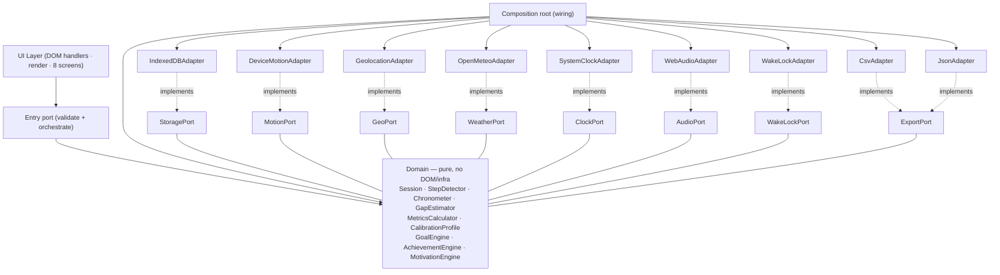

# Architecture Spine — WalkTracker PWA v3.0

## Design Paradigm

**Hexagonal-lite** (ports & adapters), right-sized to a single-file app. Hereda el paradigma de v1.0: tres capas lógicas viven en archivos separados; el **Domain** es JS puro (sin DOM, sin infra) y por ende testeable sin navegador.

**Cambio estructural v3:** el dominio crece de 4 a 8 módulos. El aggregate `Session` cambia de medir vueltas a medir pasos. Tres nuevos engines (`GoalEngine`, `AchievementEngine`, `MotivationEngine`) comparten lenguaje ubicuo con v2 nativa — son reutilizables como cambio de adaptadores, no de modelo.

| Layer | Responsibility | May depend on |
| --- | --- | --- |
| **UI** | DOM handlers, render, pantallas Home/Session/Summary/Settings/History/Achievements/MotionDenied | Application entry port |
| **Application (entry port)** | Validate raw input, orchestrate use cases, wire adapters (composition root) | Domain + port interfaces |
| **Domain** | `Session` (aggregate root), `StepDetector`, `Chronometer`, `GapEstimator`, `MetricsCalculator`, `CalibrationProfile`, `GoalEngine`, `AchievementEngine`, `MotivationEngine` | nothing outward |
| **Adapters (edge)** | `IndexedDBAdapter`, `DeviceMotionAdapter`, `GeolocationAdapter`, `OpenMeteoAdapter`, `SystemClockAdapter`, `WebAudioAdapter`, `WakeLockAdapter`, `CsvAdapter`, `JsonAdapter` | Domain port interfaces (implement them) |

Ports son interfaces definidas **en el dominio**; adapters las implementan. El composition root (capa Application) es el único lugar que conoce adapters concretos.



El set de flechas **es** la regla: toda dependencia apunta hacia el Domain. El Domain define los ports; nada en el Domain importa un adapter, el DOM, o una API del navegador.

## Invariants & Rules

### AD-1 — Hexagonal-lite; dependency rule points inward [HEREDADO, vigente]
- **Binds:** all
- **Prevents:** domain coupling to framework/DOM/infra; UI calling storage directly.
- **Rule:** dependencies point toward the Domain. The Domain has zero imports of DOM or infrastructure. Ports are interfaces defined in the Domain; adapters live at the edge and implement them. *(Invariante de proyecto `AGENTS.md`.) [fuente: ARCHITECTURE-SPINE v1 AD-1]*

### AD-2 — Vanilla JS single-file + separate sw.js + JSON bundles [ADOPTED, actualizado]
- **Binds:** RNF-05
- **Prevents:** build toolchain, framework lock-in, CDN runtime dependency.
- **Rule:** `index.html` (HTML+CSS+JS vanilla), `domain.js` (dominio puro extraíble), `sw.js` (Service Worker). Sin framework/bundler/CDN. Excepción: `quotes.json` (banco de 100 frases, AD-18) se sirve como asset local (mismo origen). *[fuente: SPEC ADR-01; RNF-05]*

### AD-3 — StoragePort abstrae IndexedDB (sesiones) + localStorage (config) [ADOPTED, actualizado]
- **Binds:** RNF-02, RF-08, RF-11
- **Prevents:** storage coupling leaking into the Domain; bloqueo por evicción de iOS.
- **Rule:** `StoragePort` abstrae dos mecanismos: **IndexedDB** para stores `sessions` y `achievements` (volumen creciente, asíncrono); **localStorage** para `wt:config` y `wt:activeSession` (acceso síncrono, pequeño). `navigator.storage.persist()` se solicita al instalar. El adapter `IndexedDBAdapter` implementa ambos. *[fuente: SPEC RNF-02; ADR-16]*

### AD-4 — Session aggregate rediseñado: stepsMeasured/stepsEstimated/strideM [ADOPTED, actualizado]
- **Binds:** RF-01, RF-02, RF-03, RF-04, RF-05, RF-08, RF-14
- **Prevents:** inconsistent session state; history rewrite on recalibration; mezcla opaca de medición y estimación.
- **Rule:** el aggregate `Session` expone `stepsMeasured` (entero ≥0), `stepsEstimated` (entero ≥0, default 0), `strideM` (>0, congelado al cierre). Distancia = `(stepsMeasured + stepsEstimated) × strideM`, derivada. `stepsEstimated` se almacena **desglosado** y se muestra con prefijo "~" en UI (RF-05). Sesión finalizada es **immutable**; congela `strideM`. No hay concepto `laps` ni `lapPerimeterM` en v3 (eliminado del producto). *[fuente: SPEC §8 Modelo de datos; ADR-14]*

### AD-5 — StrideM es la única medida cruda de calibración [ADOPTED, actualizado]
- **Binds:** RF-03, RF-14
- **Prevents:** dual sources of truth para perímetro; history drift on recalibration.
- **Rule:** `config.strideM` es la única medida cruda editable (default 0.655 m — validado en campo en v1). No hay `stepsPerLap` ni `lapPerimeterM` en v3. Sesiones cerradas conservan su `strideM` congelado. *[fuente: SPEC §2 R8; RF-03; RF-14]*

### AD-6 — Wall-clock chronometer; explicit-only pause [HEREDADO, vigente]
- **Binds:** RF-01, RNF-03
- **Prevents:** drift from JS timers frozen by iOS backgrounding; incorrect time after recovery.
- **Rule:** `elapsedS = (now − startedAt) − totalPausesS`, computed from `Date.now()` via `ClockPort`. A `setInterval` may drive the display tick but is **never** the source of truth. Pause happens only via the explicit button; switching apps does not pause. *[fuente: SPEC ADR-05 heredado]*

### AD-7 — Validation at the frontier (entry port) [HEREDADO, vigente]
- **Binds:** RF-03, RF-10, RF-14, all input
- **Prevents:** invalid aggregates materialized inside the Domain.
- **Rule:** raw inputs (`strideM`, `weeklyGoalKm`) son validados (`> 0`, finite numbers) en el entry port antes de construir aggregates. El Domain permanece siempre-válido. *(Invariante de proyecto `AGENTS.md`: validación en la frontera.)*

### AD-8 — Silent recovery from active-session snapshot [HEREDADO, actualizado]
- **Binds:** RNF-03, RF-01, RF-05
- **Prevents:** data loss on iOS purge; ambiguous resume UX.
- **Rule:** autosave del active session a `wt:activeSession` cada 10s y en cada `visibilitychange`. Al abrir, si existe snapshot, resume **silenciosamente** recomputando elapsed desde `startedAt` (wall-clock). El gap de pasos se trata como background gap (AD-13). "Sesión recuperada" indicator aparece 3s (UX spec). *[fuente: SPEC RNF-03]*

### AD-9 — Web Audio adapter for feedback; AudioContext unlocked at Start [HEREDADO, actualizado]
- **Binds:** RF-12
- **Prevents:** a beep that fails on iOS (AudioContext suspended); reliance on the unavailable `navigator.vibrate`.
- **Rule:** feedback fluye through `AudioPort` (`WebAudioAdapter`). El `AudioContext` se crea lazy y se resume en el gesto de usuario "Iniciar caminata". v3 extiende los eventos: inicio sesión, cada km, meta cumplida, logro desbloqueado (RF-12). `navigator.vibrate` no se usa (ausente en iOS Safari). *[fuente: SPEC ADR-R5; RF-12]*

### AD-10 — Offline-first via Service Worker app-shell cache [HEREDADO, vigente]
- **Binds:** RNF-01
- **Prevents:** runtime network dependency.
- **Rule:** `sw.js` caches the app shell (`index.html`, `domain.js`, `sw.js`, `manifest.webmanifest`, `quotes.json`, icons) on `install` and serves it cache-first. Única llamada de red: Open-Meteo (AD-14), con timeout 3s y degradación limpia. *[fuente: MDN Service Worker API; SPEC RNF-01]*

### AD-11 — Deployment: GitHub Pages static; all paths relative [HEREDADO, vigente]
- **Binds:** SPEC §15
- **Prevents:** broken Service Worker scope / broken install under a project subpath.
- **Rule:** served as static files over HTTPS from GitHub Pages. `sw.js` registered with `scope: "./"`; `manifest.start_url` and `scope` are `"./"`; no absolute paths. `.nojekyll` present. Publish from `main` via PR (GitFlow). *[fuente: SPEC §15]*

### AD-12 — StepDetector puro: acelerómetro foreground como única fuente de pasos reales [ADOPTED]
- **Binds:** RF-02, RF-04, RNF-04
- **Prevents:** dependencia de coprocesador inexistente en PWA; conteo en background opaco.
- **Rule:** `StepDetector` es dominio puro: recibe muestras de magnitud de aceleración vía `MotionPort.sample(magnitude)`, aplica filtro paso-bajo (α=0.2) y emite eventos `onStep()` con detección de picos sobre umbral adaptativo y ventana refractaria de 300 ms (cadencia máx ~200 spm). **Frecuencia fija 60 Hz** (decisión D2). Requiere pantalla activa (foreground + wake lock AD-16). El detector es testeable con trazas grabadas (input → output determinista). *[fuente: SPEC ADR-13; RNF-04]*

### AD-13 — GapEstimator por cadencia; siempre marcado "~" [ADOPTED]
- **Binds:** RF-05
- **Prevents:** invención opaca de pasos; mezcla de medición y estimación sin distinción.
- **Rule:** al volver a foreground (`visibilitychange`), si la sesión estaba activa (no pausada) y hay ≥120s de muestra previa, `GapEstimator` calcula `stepsEstimated += cadenceSpm × (gapS/60)`. La cadencia se calcula **solo sobre tramos medidos** (`stepsMeasured / minutosConSensorActivo`), nunca sobre estimados (evita realimentar la estimación). Los pasos estimados se almacenan desglosados, se muestran con prefijo "~" en color `estimated`, y el usuario puede **descartarlos** al volver (RF-05). Si la sesión estaba pausada o no hay muestra previa, gap = 0. *[fuente: SPEC ADR-14; RF-05]*

### AD-14 — Open-Meteo como proveedor de clima; sin key, sin cuenta [ADOPTED]
- **Binds:** RF-06
- **Prevents:** secretos en cliente público; dependencia de cuenta/servicio de pago.
- **Rule:** `WeatherPort` → `OpenMeteoAdapter`. Flujo: `GeoPort.oneShot()` → coordenadas redondeadas a 2 decimales (privacidad RNF-06) → `OpenMeteoAdapter.fetch(coords)` con timeout 3s. Snapshot congelado al inicio de sesión. Sin red → "Sin clima" (degradación limpia, non-blocking). Sin API key, sin CORS issues. *[fuente: SPEC ADR-15; RF-06; RNF-06]*

### AD-15 — Export como mecanismo de respaldo de primera clase [ADOPTED]
- **Binds:** RF-15, RF-17, RNF-02
- **Prevents:** pérdida total de datos por evicción de storage iOS.
- **Rule:** `ExportPort` expone `toCsv(sessions)` y `toJson(sessions)`. El export se invoca vía Web Share API (`navigator.share`) desde Settings. `config.lastExportAt` se actualiza. Si >30 días sin export, banner en Settings + badge en ⚙ (RF-17). El JSON exportado es **importable** (prueba de respaldo/restauración, SPEC §13). *[fuente: SPEC ADR-16; RF-15; RF-17]*

### AD-16 — WakeLock activo durante sesión; re-adquisición en foreground [ADOPTED]
- **Binds:** RF-13
- **Prevents:** pantalla apagada → pérdida de detección de pasos (AD-12).
- **Rule:** `WakeLockPort` → `WakeLockAdapter` envuelve `navigator.wakeLock.request('screen')`. Se adquiere al iniciar sesión. Si falla o se libera (p. ej. tab en background), se muestra banner `secondary` "Mantén la pantalla encendida para contar pasos" (UX spec). Al volver a foreground (`visibilitychange`), se **re-adquiere** automáticamente. Si `navigator.wakeLock` no existe, el banner persistente es la única mitigación. *[fuente: SPEC RF-13; MDN Wake Lock API]*

### AD-17 — Geolocation one-shot; permiso opcional [ADOPTED]
- **Binds:** RF-06
- **Prevents:** bloqueo de sesión por permiso de ubicación denegado.
- **Rule:** `GeoPort` → `GeolocationAdapter` usa `navigator.geolocation.getCurrentPosition` con `enableHighAccuracy: false`, `timeout: 3000`, `maximumAge: 300000`. Coordenadas redondeadas a 2 decimales antes de enviar a Open-Meteo (privacidad RNF-06). Si permiso denegado o timeout → sesión inicia sin clima (degradación limpia, non-blocking). *[fuente: SPEC RF-06; RNF-06]*

### AD-18 — Frases motivacionales en bundle JSON; sin repetición reciente [ADOPTED]
- **Binds:** RF-07
- **Prevents:** dependencia de red para frases; frases repetidas en sesiones consecutivas.
- **Rule:** `quotes.json` se sirve como asset local (cacheado por SW, AD-10). Contiene 100 frases. `MotivationEngine` selecciona aleatoriamente excluyendo los IDs en `config.recentQuoteIds` (últimas 20). Rotación del array de exclusión al llenarse. `config.recentQuoteIds` persiste en localStorage. *[fuente: SPEC ADR-11 heredado; RF-07]*

## Decisión de migración de datos D1 — Sesiones v1.1 → v3 [ADOPTED]

**Decisión (Paul):** migrar sesiones v1.1 existentes calculando `stepsMeasured` inversamente.

- **Migración:** al detectar `localStorage["wt:sessions"]` con formato v1 (presencia de campo `laps`), el adapter `IndexedDBAdapter` migra una sola vez (flag `wt:migrated` en localStorage):
  - `stepsMeasured = round(distanceM / strideM)` (estimación inversa desde distancia conocida)
  - `stepsEstimated = 0` (las sesiones v1 no tuvieron gaps estimados)
  - `strideM = lapPerimeterM / stepsPerLap` (reconstruido desde campos congelados)
  - `source: "migrated"` (metadato obligatorio para distinguir)
  - `distanceM`, `durationS`, `paceSecPerKm`, `pausesS`, `startedAt`, `endedAt` se conservan
- **Cadencia:** sesiones con `source: "migrated"` **no se incluyen** en cálculo de `cadenceSpm` (AD-13) — no hay tramos medidos reales. Se muestran en history con distancia/tiempo/ritmo correctos.
- **Logros/Goal:** sesiones migradas **sí cuentan** para `GoalEngine` (distancia semanal) y `AchievementEngine` (km acumulados, primera sesión, etc.) — la distancia es correcta.
- **Idempotencia:** si `wt:migrated === "v3"`, no se re-migra. Si no existe el flag, se migra y se setea.

*Trade-off documentado:* `stepsMeasured` migrado es una estimación inversa, no medición real. El metadato `source` permite distinguir. Las métricas sensibles a la fuente (cadencia) lo respetan; las métricas robustas a la fuente (distancia, meta, logros de km) no se ven afectadas. *[fuente: decisión producto Paul 2026-07-07]*

## Consistency Conventions

| Concern | Convention |
| --- | --- |
| Naming (entities, files) | `PascalCase` domain types (`Session`, `StepDetector`, `GoalEngine`); `camelCase` functions/fields; localStorage keys prefixed `wt:`; IndexedDB store names lowercase plural (`sessions`, `achievements`) |
| Data & formats | timestamps ISO-8601 (ms) en storage; durations integer seconds; distance float meters (2 dp); steps integer; cadence float spm (1 dp); `source: "migrated"` para sesiones migradas de v1 |
| State & mutation | Domain types immutable after construction; mutation returns new state; los únicos mutables son IndexedDB (vía `StoragePort`) y localStorage (config/snapshot) |
| Errors | Domain throws specific errors (`RangeError` for invariant violation, `TypeError` for bad input); adapters catch errores de infra (red, permiso) y degradan limpio (return null o flag); UI muestra feedback |
| Config | Single source `localStorage["wt:config"]` (`strideM`, `weeklyGoalKm`, `soundEnabled`, `recentQuoteIds`, `lastExportAt`) |
| Privacy | coordenadas geográficas redondeadas a 2 decimales antes de enviar a Open-Meteo (RNF-06); única llamada de red |

## Stack

*Seed — verified current at authoring. The code owns this once it exists. Cero runtime dependencies.*

| Name | Version | Source |
| --- | --- | --- |
| JavaScript | ES2020+ (vanilla, sin transpile) | — |
| Platform | iOS Safari 16.4+ — PWA instalable | *[fuente: SPEC §2 R10]* |
| IndexedDB API | nativa (async, transactional) | *[fuente: MDN]* |
| DeviceMotionEvent API | nativa (`requestPermission()` iOS 13+) | *[fuente: MDN]* |
| Geolocation API | nativa (one-shot) | *[fuente: MDN]* |
| Open-Meteo API | REST pública, sin key, CORS abierto | *[fuente: open-meteo.com]* |
| Wake Lock API | nativa (`navigator.wakeLock`, iOS 16.4+) | *[fuente: MDN]* |
| Web Audio API | nativa (Baseline) | *[fuente: MDN AudioContext]* |
| Web Share API | nativa (`navigator.share`) | *[fuente: MDN]* |
| Web Push API | nativa (iOS 16.4+, PWA instalada) — Could, opcional | *[fuente: MDN; SPEC RF-18]* |
| Service Worker API | nativa (requiere HTTPS) | *[fuente: MDN]* |

## Structural Seed

```text
{root}/                       # raíz servida por GitHub Pages
  index.html                  # UI + Application (entry port, composition root)
  domain.js                   # Domain (puro, extraíble, testeable en Node)
  quotes.json                 # Banco de 100 frases motivacionales (AD-18)
  sw.js                       # Service Worker: cache app-shell + quotes.json
  manifest.webmanifest        # start_url "./", scope "./", display standalone
  .nojekyll                   # evita procesado Jekyll en Pages
  icons/                      # iconos PWA (relativos)
  test/                       # pruebas del dominio puro (Node nativo)
```

**Port contracts (seed — el código los detalla):**

```text
StoragePort:  getConfig(), saveConfig(cfg)
              getSessions(), saveSession(s), deleteSession(id)        # IndexedDB
              getAchievements(), saveAchievement(a)                   # IndexedDB
              getActiveSession(), saveActiveSession(s|null)           # localStorage
              persist()                                               # navigator.storage.persist()
MotionPort:   requestPermission() → bool
              onSample(callback)                                      # magnitud aceleración @ 60 Hz
              start(), stop()
GeoPort:      oneShot() → {lat, lon} | null                           # timeout 3s
WeatherPort:  fetch({lat, lon}) → {tempC, feelsLikeC, condition, humidityPct, uvIndex, windKmh} | null   # timeout 3s
ClockPort:    now() → epochMs
AudioPort:    unlock()                                                # resume AudioContext on user gesture
              beep(freq, durationMs)                                  # 440/660 Hz para distintos eventos
WakeLockPort: acquire(), release(), onLost(callback), onAcquired(callback)
ExportPort:   toCsv(sessions) → string
              toJson(sessions) → string
              share(data) → bool                                     # Web Share API
```

**Storage shapes (pinned — cierra divergencias de AD-3/AD-4/AD-13):**

```text
localStorage["wt:config"] → { strideM: number, weeklyGoalKm: number, soundEnabled: boolean,
                              recentQuoteIds: number[], lastExportAt: ISO8601|null }
localStorage["wt:activeSession"] → { startedAtMs, stepsMeasured, stepsEstimated, totalPausesMs,
                                     paused, strideM, weather: {...}|null, quoteId }
localStorage["wt:migrated"] → "v3" | absent                          # flag migración D1

IndexedDB store "sessions" → {
  id, startedAt, endedAt,
  stepsMeasured,                      # acelerómetro (AD-12); estimación inversa si source:"migrated"
  stepsEstimated,                     # gaps de background (AD-13); 0 si no hubo o se descartó
  strideM,                            # congelado al cierre (AD-5)
  distanceM,                          # (measured+estimated) × strideM, cacheado
  durationS, pausesS,
  paceSecPerKm, cadenceSpm,
  weather: { tempC, feelsLikeC, condition, humidityPct, uvIndex, windKmh, capturedAt } | null,
  quoteId,
  source: "v3" | "migrated"           # distingue sesiones migradas de v1 (D1)
}

IndexedDB store "achievements" → { key, unlockedAt: ISO8601|null, progress: 0.0..1.0 }
```

**Entornos / sobre operativo:** un solo entorno de runtime (producción = GitHub Pages). Desarrollo local sirviendo archivos sobre HTTPS (`http://localhost` cuenta como secure context para SW y DeviceMotion). No hay backend, CI/CD de servidor ni infraestructura cloud — el despliegue es `git push`/Action a Pages desde `main` vía PR (GitFlow).

## Capability → Architecture Map

| Capability / Area | Lives in | Governed by |
| --- | --- | --- |
| RF-01 Control sesión + cronómetro | `Session` + `Chronometer` + `ClockPort` | AD-1, AD-6, AD-8 |
| RF-02 Detección pasos + permiso motion | `StepDetector` + `MotionPort` / `DeviceMotionAdapter` | AD-12 |
| RF-03 Distancia = pasos × zancada | `MetricsCalculator` | AD-4, AD-5 |
| RF-04 Métricas en vivo | `MetricsCalculator` | AD-4 |
| RF-05 Background → extrapolación marcada | `GapEstimator` + `Session` | AD-13 |
| RF-06 Clima one-shot | `WeatherPort` / `OpenMeteoAdapter` + `GeoPort` / `GeolocationAdapter` | AD-14, AD-17 |
| RF-07 Frase motivacional | `MotivationEngine` + `quotes.json` | AD-18 |
| RF-08 Persistencia | `StoragePort` / `IndexedDBAdapter` | AD-3 |
| RF-09 Historial + tendencia | `StoragePort` + UI (canvas/SVG) | AD-3 |
| RF-10 Meta semanal + anillo | `GoalEngine` + UI | AD-4 (derive, no duplicate) |
| RF-11 Logros (14 catálogo) | `AchievementEngine` + `StoragePort` | AD-3 |
| RF-12 Feedback sonoro | `AudioPort` / `WebAudioAdapter` | AD-9 |
| RF-13 Wake lock | `WakeLockPort` / `WakeLockAdapter` | AD-16 |
| RF-14 Recalibración zancada | `CalibrationProfile` + `StoragePort` | AD-5, AD-7 |
| RF-15 Export CSV/JSON respaldo | `ExportPort` / `CsvAdapter`+`JsonAdapter` | AD-15 |
| RF-16 Eliminar sesiones | `StoragePort.deleteSession()` | AD-3 |
| RF-17 Aviso respaldo >30 días | UI + `config.lastExportAt` | AD-15 |
| RF-18 Web Push (Could) | `PushPort` (futuro) | AD-11, deferred |
| RNF-01 Offline | `sw.js` | AD-10 |
| RNF-02 Persistencia persistente | `navigator.storage.persist()` + IndexedDB | AD-3 |
| RNF-03 Resiliencia/recuperación | `StoragePort` + `Chronometer` + `GapEstimator` | AD-8, AD-13 |
| RNF-04 CPU sensores ≤60 Hz | `StepDetector` | AD-12 |
| RNF-05 Cero build | vanilla JS + `quotes.json` | AD-2 |
| RNF-06 Privacidad | `GeolocationAdapter` (round 2 dp) | AD-17 |
| RNF-07 UX claro/oscuro | UI (`prefers-color-scheme`) | (UX spine) |

## Deferred

- **RF-18 Web Push (Could):** `PushPort` + `PushAdapter` (`PushManager`, VAPID). Deferred a v3.1 — requiere generar keys VAPID, servicio de push (p. ej. configuración estática en el bundle), y suscripción. No bloquea v3.0.
- **Cache-busting / versionado de `sw.js`:** estrategia de actualización del SW al publicar nuevas versiones (p. ej. versión en `CACHE_NAME` + `skipWaiting`). Mismo problema que v1.
- **Migración de sesiones v1 reales:** si Paul tiene sesiones v1.1 en producción, la migración D1 se ejecuta una sola vez en su dispositivo. Probar con datos reales antes de finalizar v3.0.
- **Calibración interactiva de zancada:** caminar N pasos para medir zancada promedio automáticamente. Decisión de producto futura (no en SPEC v3).
- **Umbral adaptativo del StepDetector:** AD-12 fija umbral adaptativo pero el algoritmo exacto (p. ej. ventana deslizante de 10s) se calibra con trazas reales. Decisión de implementación, no bloqueante para el spine.
- **Web Push service worker:** si RF-18 se promueve, requiere `push` event handler en `sw.js` y `notificationclick`. Diseño diferido.
